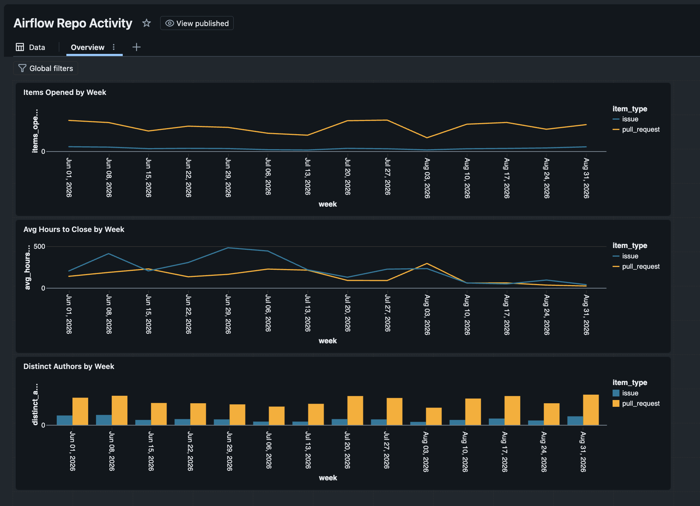

# Airflow GitHub Activity Pipeline

An incremental ELT pipeline that pulls issue and pull request data from the GitHub API, lands it in Databricks, models it with dbt, and surfaces it in a dashboard.

The subject is the [apache/airflow](https://github.com/apache/airflow) repository — an orchestration tool, analyzed by an orchestrated pipeline.



## Architecture

```
GitHub API  →  Bronze (Delta)  →  Silver (dbt)  →  Gold (dbt)  →  Dashboard
  Python         raw payloads      parsed, typed    aggregated     Databricks SQL
  PySpark        append-only       deduplicated     by week
```

| Layer | Tool | What it does |
|---|---|---|
| Ingest | Python + PySpark, Databricks notebook | Paginated API pull with an incremental watermark |
| Bronze | Delta table | Raw JSON payloads, append-only, never transformed |
| Silver | dbt (`stg_issues`) | JSON parsing, type casting, deduplication |
| Gold | dbt (`fct_weekly_activity`) | Weekly aggregates by item type |
| Dashboard | Databricks SQL | Three charts over the gold table |

Extraction runs inside Databricks because it needs Spark and network access. dbt runs locally and connects to the SQL warehouse over the wire — dbt is a SQL compiler, so the code lives on a laptop while the tables live in the warehouse.

## Design decisions

**Raw payloads land untransformed in bronze.** The ingest writes the full JSON response as a string alongside an ingest timestamp. Parsing happens downstream in dbt. When the API adds a field or a parsing assumption turns out wrong, the fix is a model change and a rebuild rather than a full re-ingest.

**The watermark comes from the data, not the clock.** Each run queries `max(updated_at)` from bronze and passes it to the API's `since` parameter. There is no scheduler state to keep in sync, and a failed run costs nothing — the next one picks up from wherever the data actually is.

**Deduplication belongs in silver, not extraction.** GitHub's `since` filter is inclusive, so the record sitting exactly on the watermark boundary is returned by two consecutive runs. Rather than trying to make extraction perfectly exclusive, the staging model keeps only the latest version of each `issue_id` via a window function. Bronze holds 4,883 rows; silver holds 4,881.

**Issues and pull requests come from one endpoint.** GitHub's issues endpoint returns both, distinguished by the presence of a `pull_request` key. One extraction path, one bronze table, and the split happens as a derived boolean in staging.

## A constraint worth documenting

Databricks Free Edition restricts outbound network access from serverless compute to an allowlist of domains. The original plan targeted the NYC Open Data 311 dataset, which failed at DNS resolution — the request never left the sandbox.

The fallback would have been to run extraction locally and land files into a Unity Catalog volume, which is the same pattern managed tools like Fivetran and Airbyte use. Before committing to that, a socket test against several candidate hosts showed `api.github.com` resolved fine. GitHub became the source, and the pipeline stayed entirely inside Databricks.

Worth checking connectivity before designing around a data source.

## Data quality

`dbt build` runs models and tests together, so a failing test blocks downstream models rather than quietly corrupting the mart.

| Test | Column | Catches |
|---|---|---|
| `unique` | `issue_id` | Broken deduplication logic |
| `not_null` | `issue_id` | Malformed payloads |
| `not_null` | `created_at` | Parsing or casting failures |
| `accepted_values` | `state` | Unexpected API state values |

Source freshness is configured on the bronze table with a 24-hour warning threshold.

## What the data shows

Three months of activity, June through early September 2026.

**Pull requests outnumber issues roughly 7 to 1.** Around 250–300 PRs open per week against 25–45 issues. Contributor counts follow the same shape, with 3–4× more distinct PR authors than issue authors, consistently week over week.

**Pull requests close substantially faster.** PRs average 130–230 hours to close. Issues run 200–480 hours and are far more volatile, peaking near 480 hours in late June.

**The recent convergence is probably an artifact.** Both series drop sharply after mid-August. This is survivorship bias: items that close quickly are already closed and counted, while items that will take 400 hours are still open and contribute nothing to the average yet. Recent weeks will drift upward as slow items resolve. Any time-to-close metric computed over an incomplete window has this problem, and the honest reading is that the last three or four weeks are not yet comparable to the earlier ones.

## Running it

**Ingest** — import `notebooks/01_ingest_issues.py` into Databricks. It expects a GitHub personal access token in a secret scope:

```python
w.secrets.create_scope(scope="github")
w.secrets.put_secret(scope="github", key="pat", string_value="<token>")
```

**Transform** — from the project root:

```bash
python3 -m venv .venv
source .venv/bin/activate
pip install dbt-databricks
dbt debug
dbt build
```

`profiles.yml` lives in `~/.dbt/` and needs the workspace host, the SQL warehouse HTTP path, a Databricks PAT, catalog `gh`, and schema `dbt_dev`.

## Repository layout

```
models/
  staging/
    _sources.yml       bronze table definition and freshness
    stg_issues.sql     parsing, typing, deduplication
    _models.yml        column tests
  marts/
    fct_weekly_activity.sql
notebooks/
  01_ingest_issues.py  API extraction
images/
  dashboard.png
```

## Possible extensions

- Schedule the ingest as a Databricks job and add a dbt task downstream
- Add commits and reviews as separate entities, giving the DAG real dimensional joins
- Switch `stg_issues` to an incremental model with a merge strategy, so rebuilds do not rescan all of bronze
- Add a label dimension to break activity down by issue category
