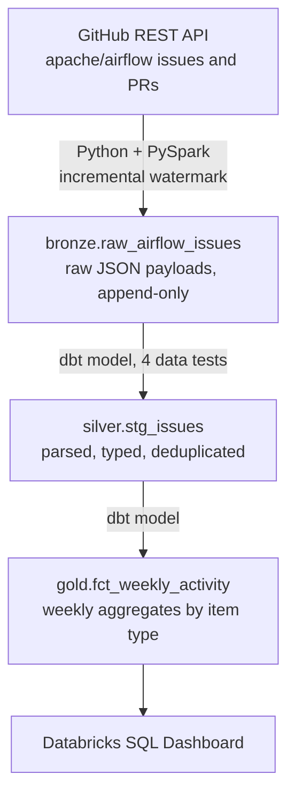
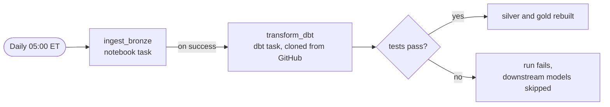

# Airflow GitHub Activity Pipeline

A scheduled ELT pipeline that ingests issue and pull request data from the GitHub API, models it through a medallion architecture with dbt, and surfaces engineering metrics in a dashboard. The subject is the [apache/airflow](https://github.com/apache/airflow) repository.

This README explains the decisions behind the design rather than restating the code. The code is in `models/` and `notebooks/`.


## Architecture



Orchestration runs entirely inside Databricks as a single scheduled job:



---

## Why it is built this way

### Why bronze stores raw JSON instead of parsed columns

The ingest writes the full API response as a string with an ingest timestamp, and does no parsing at all. Every field extraction happens downstream in dbt.

The alternative — parsing on ingest — is faster to query but couples storage to the current understanding of the schema. When GitHub adds a field, or when a parsing assumption turns out to be wrong, parsed-on-ingest means re-requesting data from the API to recover. Raw-on-ingest means changing a model and rebuilding.

The cost is storage plus a JSON parse on every silver build. At this volume that's a few seconds. The insurance is worth more than the seconds.

### Why the watermark comes from the data, not from a scheduler

Each run queries `max(updated_at)` from bronze and passes it to the API's `since` parameter. Nothing is stored about when the last run happened.

This makes the pipeline stateless. A failed run costs nothing, because the next one picks up from wherever the data actually is rather than from where a scheduler believed it should be. There is no cursor file to corrupt, no state table to fall out of sync, and no manual intervention needed after a failure. Running the job twice in a row is harmless.

The tradeoff is one extra query per run — cheap insurance against the entire class of bugs where scheduler state and data state diverge.

### Why deduplication lives in silver rather than in extraction

GitHub's `since` filter is inclusive, so the record sitting exactly on the watermark boundary comes back in two consecutive runs. Bronze holds 4,883 rows; silver holds 4,881.

Extraction could be made exclusive by tracking IDs already seen, but that reintroduces exactly the state problem the watermark design avoids. Instead the staging model keeps only the latest version of each `issue_id` using a window function, and a `unique` test on that column fails the build if the logic ever breaks.

This is the general principle the pipeline follows: let extraction stay simple and slightly lossy in the safe direction, then make correctness a property of the model, where it is testable.

### Why dbt for silver and gold instead of more notebooks

Bronze uses a notebook because ingestion genuinely needs Python — an HTTP client, pagination, secret retrieval. Silver and gold are pure SQL transformations, and putting them in notebooks would mean hand-managing execution order, writing assertions by hand, and having no lineage.

dbt provides dependency ordering, data tests, and lineage as properties of the project rather than as things to remember. `dbt build` runs models and tests together, so a failing test blocks downstream models instead of quietly propagating bad data into the mart the dashboard reads.

### Why each layer gets its own schema

`bronze`, `silver`, and `gold` are separate schemas in Unity Catalog rather than one schema holding everything.

The point is that the architecture should be legible from the catalog browser without reading any code. Someone opening the workspace sees immediately which tables are raw, which are cleaned, and which are aggregated, and can infer the direction data flows. Layering that exists only in folder names is a convention; layering that exists in the catalog is a contract.

This required overriding dbt's `generate_schema_name` macro, since the default concatenates the target schema with the custom one and would have produced `dbt_dev_silver`.

### Why dbt runs from Git rather than from a laptop

The dbt task clones this repository at run time and executes `dbt build` against the SQL warehouse. Nothing about the pipeline depends on a particular machine being awake.

Running dbt locally was faster to iterate on during development, and that is a real cost of this decision — testing a model change now means commit, push, and trigger a run rather than a twenty-second local build. The tradeoff is worth it because a pipeline that only runs when someone opens a terminal isn't a pipeline. It also lets Databricks trace lineage across the whole flow automatically, which it cannot do for transformations executed elsewhere.

### Why `dbt build` and not `dbt run`

The job's dbt command is a single `dbt build`, replacing the default `dbt deps` / `dbt seed` / `dbt run`.

`dbt run` executes models and skips tests entirely, which would make the four tests in this project decorative. `build` interleaves them in dependency order, so a `unique` violation on `issue_id` stops the gold model from being built on top of bad silver data. `deps` and `seed` were removed because the project has no packages and no seed files, and leaving them in would imply capability the project doesn't use.

### Why GitHub, and not the dataset originally chosen

The pipeline was designed against the NYC Open Data 311 dataset. It failed at DNS resolution — Databricks Free Edition restricts outbound network access from serverless compute to an allowlist, and that domain isn't on it.

The documented fallback would have been to extract locally and land files into a Unity Catalog volume, which is the pattern managed tools like Fivetran and Airbyte use. Before committing to that, a socket test against several candidate hosts showed `api.github.com` resolved. Switching the source kept the entire pipeline inside one platform.

GitHub also turned out to be the better subject. One endpoint returns both issues and pull requests, distinguished by the presence of a `pull_request` key, so a single extraction path yields two comparable entity types — which is what makes the analysis below possible at all.

**The transferable lesson:** test connectivity to a data source before designing around it. Five minutes of socket tests would have saved an hour.

---

## Data quality

Four tests run on every build. They are chosen to catch the specific ways this pipeline can fail, not to hit a coverage number.

| Test | Column | What it actually catches |
|---|---|---|
| `unique` | `issue_id` | Deduplication logic breaking as the watermark shifts |
| `not_null` | `issue_id` | Malformed payloads or a changed JSON key |
| `not_null` | `created_at` | Type casting failing silently |
| `accepted_values` | `state` | GitHub introducing a state value the model doesn't handle |

Source freshness is configured on bronze with a 24-hour warning threshold, so a silently failing ingest surfaces as a warning rather than as a dashboard that quietly stops moving.

---

## What the data shows

Three months of activity, June through early September 2026.

**Pull requests outnumber issues roughly 7 to 1** — around 250–300 PRs per week against 25–45 issues, with 3–4× more distinct PR authors. For a project of this size, contribution flows overwhelmingly through code rather than through discussion.

**Pull requests close substantially faster.** PRs average 130–230 hours; issues run 200–480 hours and are far more volatile.

**The recent convergence in the closing-time chart is an artifact, not an improvement.** Both series drop sharply after mid-August. Items that close quickly are already closed and counted, while items that will take 400 hours are still open and contribute nothing to the average yet. Any time-to-close metric computed over an incomplete window carries this bias, and the honest reading is that the most recent three or four weeks are not comparable to the earlier ones.

---

## Known limitations

Stated plainly, because the interesting part of a project is usually where it stops.

- **One endpoint, one repository.** The DAG is shallow — two models. Adding commits, reviews, or labels would give it real dimensional joins.
- **Silver models are full rebuilds, not incremental.** Every run rescans all of bronze. Correct but wasteful, and it stops scaling somewhere in the low millions of rows.
- **Bronze holds more history than gold surfaces.** The API's `since` filter matches on update time, so issues created in 2021 arrive if they were touched recently. The gold model filters to June 2026 onward, which is a display choice rather than a data limitation.
- **The dashboard cannot be shared.** Free Edition workspaces are single-user, so the screenshot above is the only view available to an outside reader.

---

## Running it

The pipeline runs itself daily. To reproduce it from scratch:

1. Create a GitHub personal access token and store it in a Databricks secret scope — see `notebooks/00_setup_secrets`.
2. Clone this repository as a Databricks Git folder.
3. Create a job with a notebook task pointing at `notebooks/01_ingest_issues`, and a dbt task pointing at this repository with the command `dbt build`, depending on the first.
4. Set the dbt task's warehouse catalog to `gh` and schema to `dbt_dev`. The `+schema` configs in `dbt_project.yml` route models to `silver` and `gold` from there.

## Layout

```
models/
  silver/
    _sources.yml       bronze source definition and freshness
    stg_issues.sql     parsing, typing, deduplication
    _models.yml        column tests
  gold/
    fct_weekly_activity.sql
macros/
  generate_schema_name.sql   overrides dbt's schema concatenation
notebooks/
  00_setup_secrets.py        one-time secret scope creation
  01_ingest_issues.py        API extraction into bronze
```

## Stack

Python, PySpark, SQL, Delta Lake, dbt, Databricks Workflows, Unity Catalog, Git.

---

## How Claude was used

**It compressed the work I could verify but would have been slow to write:** `Link`-header pagination, the `generate_schema_name` macro override, `profiles.yml` structure. Claude was fastest at diagnosis — a `TABLE_OR_VIEW_NOT_FOUND` after a table rename, dbt writing to `dbt_dev_silver` instead of `silver`, a job task with its dependency reversed.

**The decisions stayed mine.** When the first dataset failed connectivity, Claude's suggested fix was to move extraction off Databricks. I tested other hosts first, found GitHub reachable, and kept the pipeline on one platform. A catalog rename was suggested and I skipped it — thirty minutes of risk for something no reader would see.

Every line here was run, tested, and debugged against real data before it was committed.
