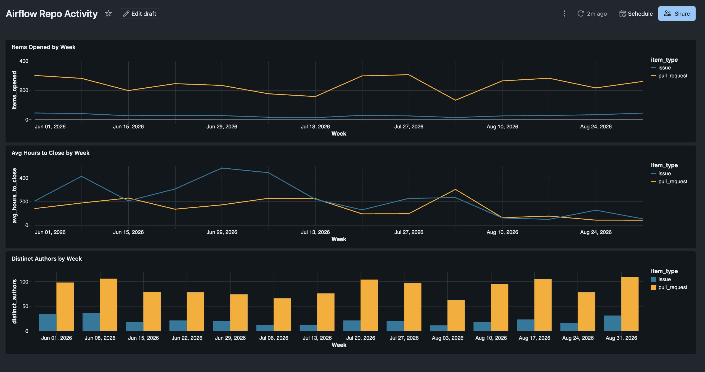
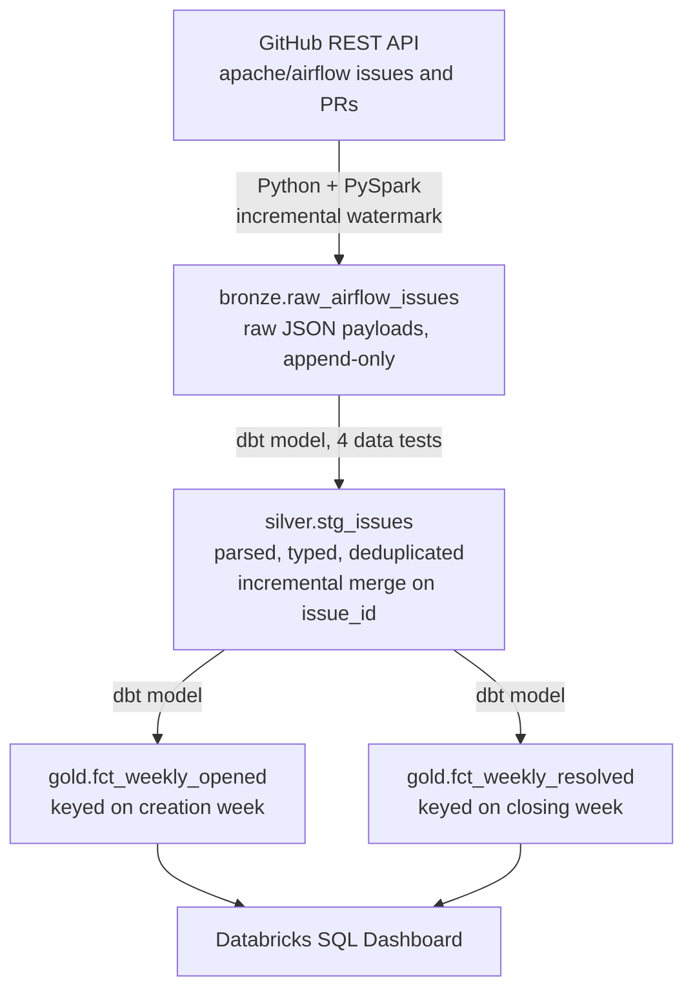

# Airflow GitHub Activity Pipeline

A scheduled ELT pipeline that ingests issue and pull request data from the GitHub API, models it through a medallion architecture with dbt, and surfaces engineering metrics in a dashboard. The subject is the [apache/airflow](https://github.com/apache/airflow) repository.

This README explains the decisions behind the design rather than restating the code. The code is in `models/` and `notebooks/`.



## Architecture



Orchestration runs entirely inside Databricks as a single scheduled job:


---

## Why it is built this way

### Why bronze stores raw JSON instead of parsed columns

The ingest writes the full API response as a string with an ingest timestamp, and does no parsing at all. Every field extraction happens downstream in dbt.

The alternative — parsing on ingest — is faster to query but couples storage to the current understanding of the schema. When GitHub adds a field, or when a parsing assumption turns out to be wrong, parsed-on-ingest means re-requesting data from the API to recover. Raw-on-ingest means changing a model and rebuilding.

The cost is storage plus a JSON parse on every silver build. At this volume that's a few seconds. The insurance is worth more than the seconds.

### Why the watermark comes from the data, not from a scheduler

Each run queries `max(updated_at)` from bronze and passes it to the API's `since` parameter. Nothing is stored about when the last run happened.

This makes the pipeline stateless. A failed run costs nothing, because the next one picks up from wherever the data actually is rather than from where a scheduler believed it should be. There is no cursor file to corrupt, no state table to fall out of sync, and no manual intervention needed after a failure. Running the job twice in a row is harmless.

The tradeoff is one extra query per run — cheap insurance against the entire class of bugs where scheduler state and data state diverge.

### How that same watermark silently lost over a thousand issues

The design above is sound, but it interacts badly with a pagination cap, and the combination cost a fifth of the dataset without raising a single error.

`fetch_issues` walked `Link` headers in a `for _ in range(max_pages)` loop with `max_pages=10` and `per_page=100` — a hard ceiling of 1,000 records per run. When a run hit that ceiling mid-stream, it stopped early. The next run then computed its `since` from `max(updated_at)` in bronze, which had already advanced past the truncation point. Everything in between was never requested again, because the watermark only moves forward.

No exception, no failed run, no test failure. The `unique` and `not_null` tests all passed, because the rows that did arrive were perfectly valid. The rows that never arrived left no trace anywhere.

The only symptom was two implausible troughs in the resolution chart: the week of July 13 showed 46 items resolved and the week of August 3 showed 3, against 250–475 in every neighbouring week. Weekly counts do not drop by two orders of magnitude and recover.

The fix was one line — `max_pages=50` — plus a backfill, run by temporarily hardcoding `since` to the start of the window so the watermark could not skip forward. That recovered roughly 1,200 issues, taking silver from 4,950 to 6,109 rows. July 13 went from 46 to 261; August 3 from 3 to 311.

**The transferable lesson:** a bounded fetch and a forward-only watermark are each reasonable in isolation and dangerous together. Any extraction that can stop early needs either an unbounded loop or a watermark that refuses to advance past a truncated batch. This class of bug produces no error signal at all. It is only ever caught by someone looking at the shape of the output and finding it implausible.

### Why deduplication lives in silver rather than in extraction

Bronze is append-only and holds roughly 10,100 rows against 6,109 distinct issues. Two things produce that gap. GitHub's `since` filter is inclusive, so the record sitting exactly on the watermark boundary returns in two consecutive runs. And the backfill described above re-fetched the entire window, giving most issues a second bronze row.

Extraction could be made exclusive by tracking IDs already seen, but that reintroduces exactly the state problem the watermark design avoids. Instead the staging model keeps only the latest version of each `issue_id` using a window function, and a `unique` test on that column fails the build if the logic ever breaks.

This is the general principle the pipeline follows: let extraction stay simple and slightly lossy in the safe direction, then make correctness a property of the model, where it is testable. The backfill was safe to run precisely because of this — thousands of duplicate rows landed in bronze and silver absorbed them without intervention.

### Why silver is incremental, and why it isn't faster

`stg_issues` is materialized incrementally with `incremental_strategy='merge'` on `issue_id`. Runs after the first filter bronze to `ingested_at >= (select max(ingested_at) from {{ this }})` and merge the result, replacing existing rows rather than appending.

It did not make the pipeline faster. The dbt task took 1m 24s as a full rebuild and 1m 22s incrementally — within noise. At roughly 6,000 rows the model itself builds in seconds, and nearly all of that duration is repository clone and dbt process startup, neither of which shrinks.

It was adopted for correctness. Issues are mutable — state, comment counts, and `closed_at` all change after creation — so the operation that matches the data is a merge on a stable key, not an append. The full-rebuild version happened to produce the same answer only because it rescanned everything every time.

Two details worth naming. The watermark comparison is `>=` rather than `>`, which reprocesses the most recent batch on every run; that is deliberate, since the merge makes reprocessing idempotent while a strict `>` would silently drop the tail of any batch whose rows carry slightly different timestamps. And the merge is last-write-wins on arrival order rather than on `updated_at`, so a genuinely out-of-order batch could overwrite a fresher row — impossible with a single sequential daily pull, but the guard would be a merge condition on `updated_at` if this ever fanned out.

### Why gold splits into two tables instead of one

The original mart, `fct_weekly_activity`, had one row per week per item type carrying both `items_opened` and `avg_hours_to_close`. Every measure was anchored to the creation week.

That conflates two different events. An issue opened June 3 and closed August 20 is an opening in June and a resolution in August, and a table keyed on creation week has to attribute both to June. Two consequences follow, neither visible until you look for them.

**Rows never settle.** The June 1 row's `avg_hours_to_close` changed every time one of that week's issues closed — for months afterward. A weekly metric that keeps moving is not a fact.

**Old items were structurally invisible.** The model filtered `created_at >= '2026-06-01'`, so an issue opened in 2021 and closed last month was excluded entirely, no matter that its resolution happened inside the window.

Splitting into `fct_weekly_opened` (keyed on creation week) and `fct_weekly_resolved` (keyed on closing week, filtered on `closed_at`) gives each table a single grain. Every column applies to every row, there are no sparse columns, and once a week passes its numbers are frozen.

The effect on the numbers was not subtle. Under the old model, issues appeared to close in 200–480 hours. Under `fct_weekly_resolved` the same repository shows 3,000–8,900 hours — roughly fifteen times higher, and a 15–20× gap against pull requests where the old model suggested 2–3×. The difference is entirely the long-lived issues that the creation-week filter had been hiding.

The cost is that comparing opens against closes now requires two datasets in the dashboard rather than one. That is the correct trade: the join is explicit, and the alternative was a number that quietly meant something other than what it claimed.

### Why dbt for silver and gold instead of more notebooks

Bronze uses a notebook because ingestion genuinely needs Python — an HTTP client, pagination, secret retrieval. Silver and gold are pure SQL transformations, and putting them in notebooks would mean hand-managing execution order, writing assertions by hand, and having no lineage.

dbt provides dependency ordering, data tests, and lineage as properties of the project rather than as things to remember. `dbt build` runs models and tests together, so a failing test blocks downstream models instead of quietly propagating bad data into the mart the dashboard reads.

### Why each layer gets its own schema

`bronze`, `silver`, and `gold` are separate schemas in Unity Catalog rather than one schema holding everything.

The point is that the architecture should be legible from the catalog browser without reading any code. Someone opening the workspace sees immediately which tables are raw, which are cleaned, and which are aggregated, and can infer the direction data flows. Layering that exists only in folder names is a convention; layering that exists in the catalog is a contract.

This required overriding dbt's `generate_schema_name` macro, since the default concatenates the target schema with the custom one and would have produced `dbt_dev_silver`.

### Why everything the job runs lives in the repository

The dbt task clones this repository at run time and executes `dbt build` against the SQL warehouse. The ingest task points at `notebooks/01_ingest_issues` inside the same Git folder. Nothing about the pipeline depends on a particular machine being awake, and nothing it runs exists outside version control.

That second half was not true for most of the project's life. The ingest notebook lived in a personal workspace directory while a stale copy of the same code sat in the repository, and the job ran the unversioned one. Everything worked, which is what made it easy to miss — the pipeline was green and the repository was wrong. Anyone cloning it would have got a project that could not ingest.

Running dbt locally was faster to iterate on during development, and that is a real cost of this decision: testing a model change means commit, push, and trigger a run rather than a twenty-second local build. The tradeoff is worth it because a pipeline that only runs when someone opens a terminal is not a pipeline. It also lets Databricks trace lineage across the whole flow automatically, which it cannot do for transformations executed elsewhere.

### Why `dbt build` and not `dbt run`

The job's dbt command is a single `dbt build`, replacing the default `dbt deps` / `dbt seed` / `dbt run`.

`dbt run` executes models and skips tests entirely, which would make the four tests in this project decorative. `build` interleaves them in dependency order, so a `unique` violation on `issue_id` stops the gold models from being built on top of bad silver data. `deps` and `seed` were removed because the project has no packages and no seed files, and leaving them in would imply capability the project doesn't use.

### Why GitHub, and not the dataset originally chosen

The pipeline was designed against the NYC Open Data 311 dataset. It failed at DNS resolution — Databricks Free Edition restricts outbound network access from serverless compute to an allowlist, and that domain isn't on it.

The documented fallback would have been to extract locally and land files into a Unity Catalog volume, which is the pattern managed tools like Fivetran and Airbyte use. Before committing to that, a socket test against several candidate hosts showed `api.github.com` resolved. Switching the source kept the entire pipeline inside one platform.

GitHub also turned out to be the better subject. One endpoint returns both issues and pull requests, distinguished by the presence of a `pull_request` key, so a single extraction path yields two comparable entity types — which is what makes the analysis below possible at all.

**The transferable lesson:** test connectivity to a data source before designing around it. Five minutes of socket tests would have saved an hour.

---

## Data quality

Four tests run on every build. They are chosen to catch the specific ways this pipeline can fail, not to hit a coverage number.

| Test | Column | What it actually catches |
|---|---|---|
| `unique` | `issue_id` | Deduplication logic breaking as the watermark shifts |
| `not_null` | `issue_id` | Malformed payloads or a changed JSON key |
| `not_null` | `created_at` | Type casting failing silently |
| `accepted_values` | `state` | GitHub introducing a state value the model doesn't handle |

Source freshness is configured on bronze with a 24-hour warning threshold, so a silently failing ingest surfaces as a warning rather than as a dashboard that quietly stops moving.

What these tests do not catch is the failure mode that actually occurred. Every one of them passed throughout the period when the pagination cap was dropping records, because they validate the rows that arrive and say nothing about rows that never do. Row-level tests cannot detect absence. Catching that class of bug requires either a volume assertion — a week with two orders of magnitude fewer records than its neighbours is not plausible — or a human looking at a chart. It was the second here.

---

## What the data shows

Three months of activity, June through early September 2026.

**Pull requests outnumber issues roughly 7 to 1** — around 250–300 PRs per week against 25–45 issues, with 3–4× more distinct PR authors. Contribution flows overwhelmingly through code rather than through discussion.

**Issues take an order of magnitude longer to resolve than pull requests.** Measured by closing week, PRs average 150–570 hours while issues run 3,000–8,900 — up to roughly thirteen months. The two populations are not comparable in kind: a pull request is a bounded proposal that gets merged or rejected, while an issue is an open question that stays open until someone chooses to close it.

**Recent weeks in the resolution table are right-censored** and should not be read as a trend. Resolved counts taper toward the present — 190 for the week of August 24, 110 for August 31 — not because resolution slowed but because items opened recently have not closed yet. Those weeks will fill in. Any metric anchored to a completion event has this property, and the most recent three or four weeks are never comparable to the earlier ones.

---

## Known limitations

Stated plainly, because the interesting part of a project is usually where it stops.

- **One endpoint, one repository.** The DAG is shallow — three models. Adding commits, reviews, or labels would give it real dimensional joins.
- **The dataset is a recent-activity sample, not repository history.** The API's `since` filter matches on `updated_at`, so an issue from 2021 appears only if something touched it inside the window. Bronze is not a snapshot of the repository; it is a snapshot of what has been active.
- **`distinct_authors` is per item type and must not be summed.** Someone who opened both an issue and a pull request in the same week counts once in each row. The dashboard renders the two series as grouped bars rather than stacked for this reason. A true weekly headcount would need a separate week-grain aggregation.
- **`avg_comments` never settles.** Comment counts keep climbing after creation, so that column reflects the most recent API pull rather than a frozen weekly value. It is the one measure in `fct_weekly_opened` that still drifts.
- **`fct_weekly_resolved` counts original authors, not closers.** GitHub exposes `closed_by`; the bronze parse does not extract it yet, so "distinct authors" in that table means the authors of items that closed, not the people who closed them.
- **Runtime is dominated by cold starts.** On Free Edition serverless, a warm dbt task runs in about 90 seconds; a cold one has taken 25 minutes waiting on warehouse startup. Wall-clock duration says more about warehouse state than about data volume.
- **The dashboard cannot be shared.** Free Edition workspaces are single-user, so the screenshot above is the only view available to an outside reader.

---

## Running it

The pipeline runs itself daily. To reproduce it from scratch:

1. Create a GitHub personal access token and store it in a Databricks secret scope named `github` with key `pat`.
2. Clone this repository as a Databricks Git folder.
3. Create a job with a notebook task pointing at `notebooks/01_ingest_issues`, and a dbt task pointing at this repository with the command `dbt build`, depending on the first.
4. Set the dbt task's catalog to `gh`. The `+schema` configs in `dbt_project.yml`, combined with the `generate_schema_name` macro, route models to `silver` and `gold` from there.

## Layout

```
models/
  silver/
    _sources.yml            bronze source definition and freshness
    stg_issues.sql          parsing, typing, deduplication, incremental merge
    _models.yml             column tests
  gold/
    fct_weekly_opened.sql   weekly aggregates keyed on creation week
    fct_weekly_resolved.sql weekly aggregates keyed on closing week
macros/
  generate_schema_name.sql  overrides dbt's schema concatenation
notebooks/
  01_ingest_issues.py       API extraction into bronze
```

## Stack

Python, PySpark, SQL, Delta Lake, dbt, Databricks Workflows, Unity Catalog, Git.

---

## How Claude was used

**It compressed the work I could verify but would have been slow to write:** `Link`-header pagination, the `generate_schema_name` macro override, `profiles.yml` structure, the incremental merge config. Claude was fastest at diagnosis — a `TABLE_OR_VIEW_NOT_FOUND` after a table rename, dbt writing to `dbt_dev_silver` instead of `silver`, a job task with its dependency reversed, and reading a `for _ in range(max_pages)` loop and identifying immediately why it would interact badly with a forward-only watermark.

**The decisions stayed mine.** When the first dataset failed connectivity, Claude's suggested fix was to move extraction off Databricks. I tested other hosts first, found GitHub reachable, and kept the pipeline on one platform. A catalog rename was suggested and I skipped it — thirty minutes of risk for something no reader would see. When the pagination bug surfaced, the suggestion was to document it as a known limitation and move on; I fixed and backfilled it instead, which is why the numbers in this README are the real ones.

**It was also wrong in ways worth recording.** It recommended a logarithmic y-axis for the resolution chart, which flattened the very trend the chart existed to show, and it once insisted a dashboard dataset was misconfigured when the binding was correct and it was reading a stale published view. Both were caught by looking at the output rather than trusting the explanation. That is the actual working relationship: fast at generation and diagnosis, unreliable about what is currently true on screen.

Every line here was run, tested, and debugged against real data before it was committed.
